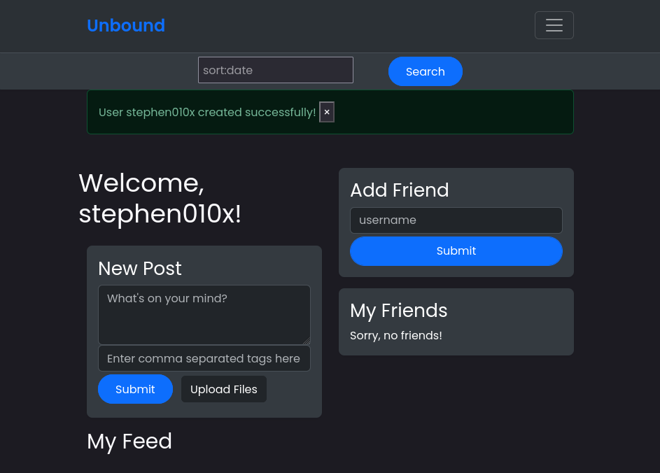
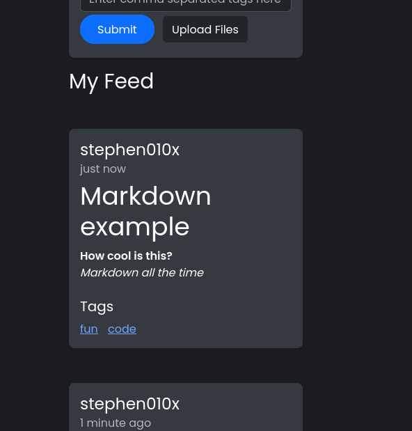
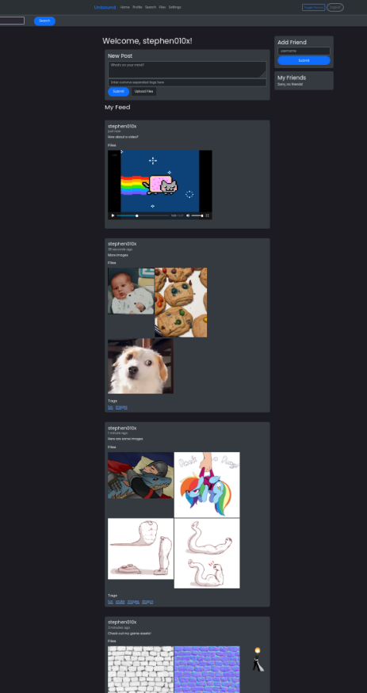
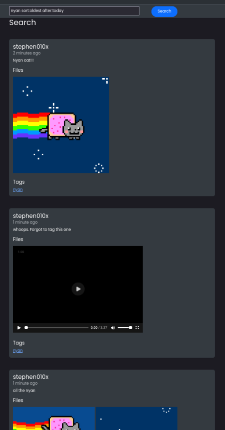

# YouFace README

This fork of YouFace is a mock social media platform. Originally designed as an assignment for CS 2450 at Utah Tech University, and further modified by the people in the teamname 'Raytheon' group.

The original project can be found here:  [cs2450-project-raytheon](https://github.com/JeffCompasClassrooms/cs2450-project-raytheon)

And the base project can be found here: [cs2450-project-youface](https://github.com/JeffCompasClassrooms/jeffcompasclassrooms-s25-cs2450-cs2450-project-youface)

The people who contributed to this fork were: \
[Supreme Executive Chairman Harris](https://github.com/stephen010x) (me) \
[UnwornPlanet](https://github.com/UnwornPlanet) \
[d00500395](https://github.com/d00500395) \
Andy Rich

## Features

### The features in the original YouFace included:
- User login
- New account creation
- Create new posts
- Friend other users
- Feed of posts from friends

### The features added in this fork
- Improved CSS/styling
- Attach any file to posts
- Media viewers for recognized file types
- Add searchable tags to post
- Full markdown support
- Encrypted passwords
- Post search bar with advanced search options

## Running the Project

To run this project, simply navigate to the main directory and run this file: \
`./youface.py`

## Screenshots

### Homepage

### Markdown

### Post Media

### Search Bar

